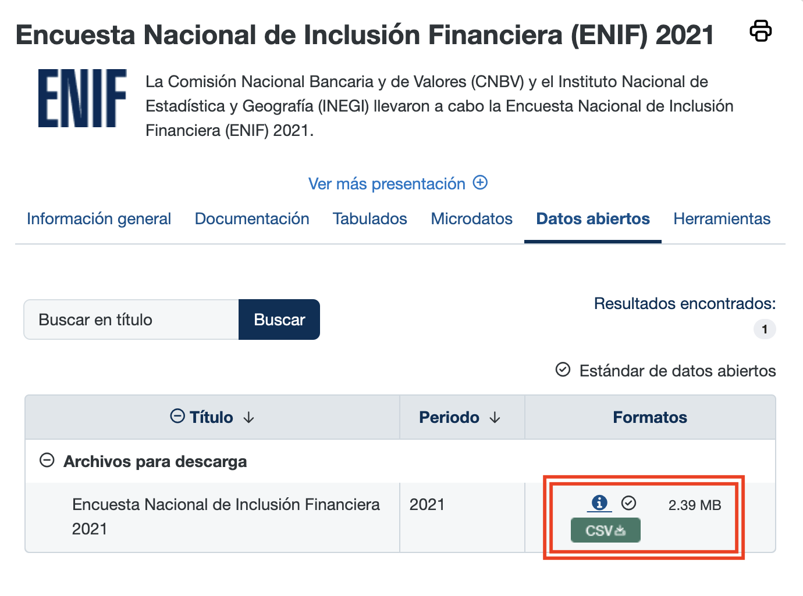
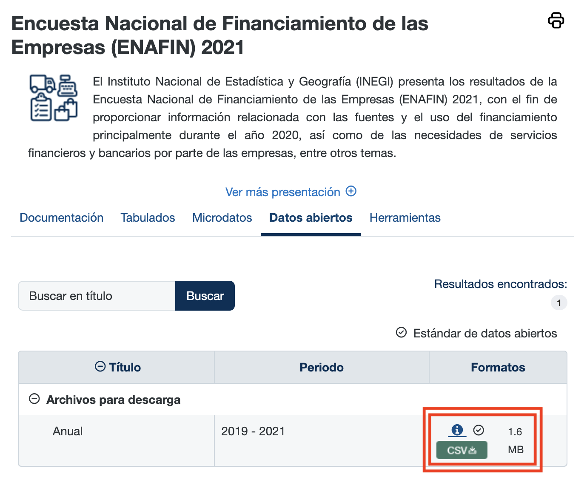
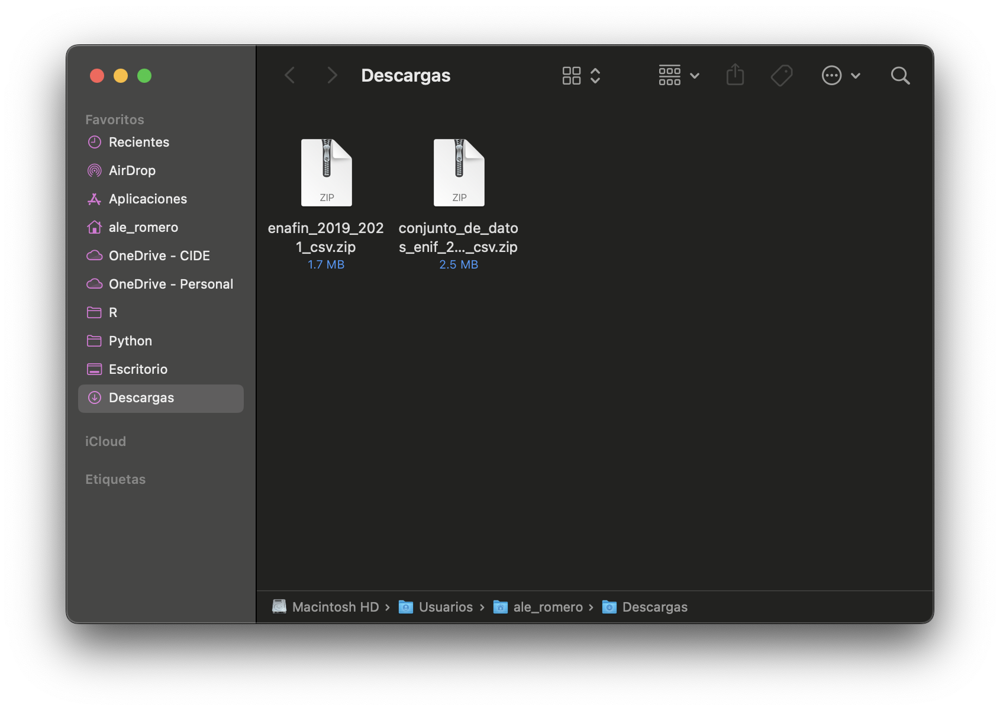
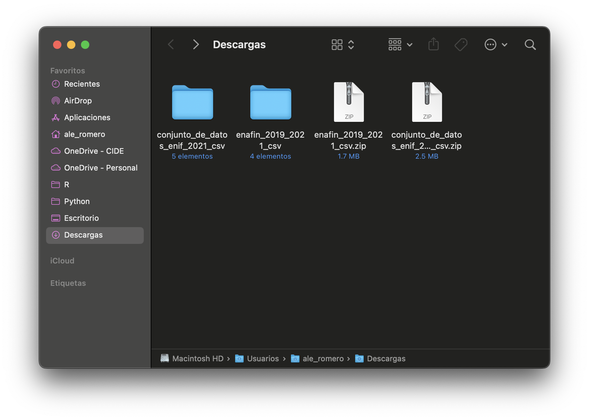
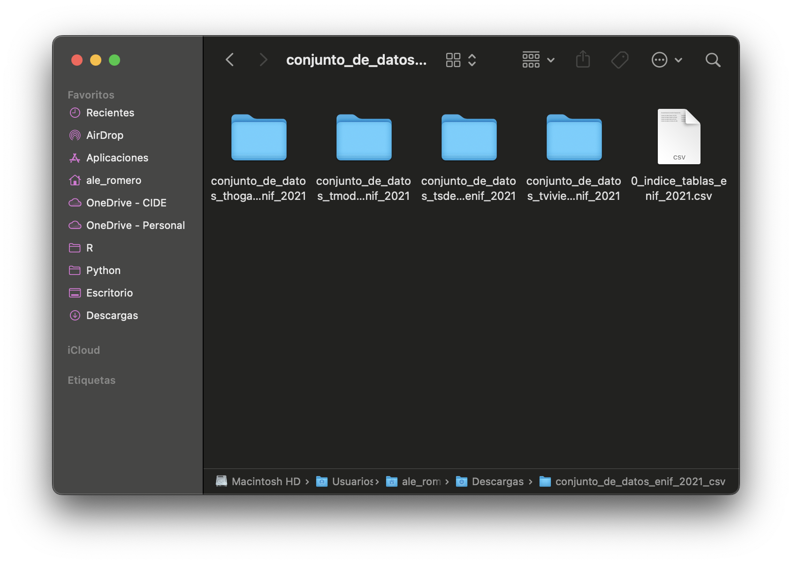
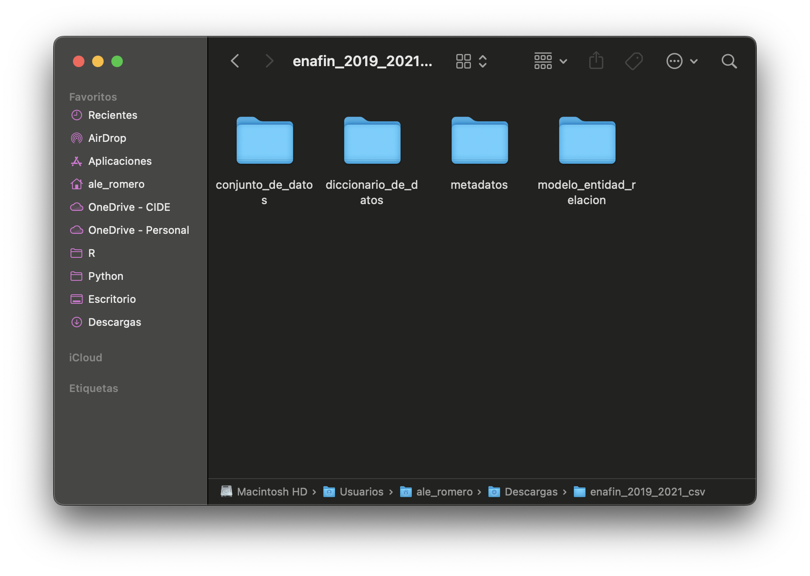

# Introducción

Las encuestas oficiales son una de las fuentes más importantes para analizar fenómenos sociales y económicos, pero trabajar con ellas requiere más que solo abrir una base de datos y directamente calcular promedios. En este tutorial usaremos dos encuestas del Instituto Nacional de Estadística y Geografía (INEGI) relacionadas con el sistema financiero: la Encuesta Nacional de Inclusión Financiera (ENIF) y la Encuesta Nacional de Financiamiento de las Empresas (ENAFIN). A partir de ellas veremos cómo descargar sus datos abiertos, leer archivos CSV en R, construir variables de análisis, respetar el diseño muestral de una encuesta compleja con `{survey}` y `{srvyr}` y crear visualizaciones que comuniquen los resultados de forma clara.

# Descarga de datos

Antes de sumergirnos en el código, primero debemos obtener los datos. A continuación, te guiaré a través de los pasos para descargarlos del sitio oficial del INEGI. Cabe destacar que, en este tutorial, utilizaremos solamente las versiones de 2021 de ambas encuestas; sin embargo, el procedimiento es casi el mismo para cualquier edición de las mismas.

En primer lugar, debemos ir al [sitio web del INEGI](https://www.inegi.org.mx/) y buscar las encuestas ENIF y ENAFIN. Para ello, podemos utilizar el buscador que aparece en la página principal o simplemente hacer clic en los siguientes enlaces:

* [Encuesta Nacional de Inclusión Financiera 2021](https://www.inegi.org.mx/programas/enif/2021/#datos_abiertos)
* [Encuesta Nacional de Financiamiento de las Empresas 2021](https://www.inegi.org.mx/programas/enafin/2021/#datos_abiertos)

Una vez que hayamos ingresado a la sección de ***Datos abiertos*** de cada encuesta, debemos cliquear estos botones que resalté con rectángulos rojos para iniciar las respectivas descargas:

```{=html}
<div style="display: flex; justify-content: center; align-items: center;">
    
    
</div>
```

<br>

Ya completadas las descargas, encontraremos los archivos de ambas encuestas en nuestra computadora. Dichos archivos deben de verse así:



Los dos archivos vienen en formato comprimido (.zip). Para poder utilizar los datos, necesitamos descomprimirlos primero. Para ello, en Windows, podemos hacer clic derecho sobre cada archivo y seleccionar la opción *Extraer aquí;* en macOS solo basta con dar doble clic en cada uno de ellos. Al haber hecho esto, veremos que se crearán dos carpetas nuevas, una para cada encuesta, que contienen los archivos de datos, los diccionarios de variables y los modelos entidad-relación de las mismas:

```{=html}
<div style="display: flex; justify-content: center; align-items: center; flex-direction: column;">
    

    <div style="display: flex; justify-content: center; align-items: center;">
        
        
    </div>
</div>
```

<br>

Con los datos descomprimidos listos, el siguiente paso es cargarlos en R y empezar a trabajar con ellos.

# Procesamiento de datos

Para empezar con el código, debemos crear un nuevo archivo de R Markdown o Quarto. En RStudio, podemos ir a *File > New File > R Markdown...* o *File > New File > Quarto Document...*, según el formato que prefiramos. Para mantener las cosas simples, conviene guardar ese archivo en la misma carpeta donde descomprimimos los datos de ambas encuestas. De esta manera, R podrá encontrar los archivos usando rutas relativas, sin necesidad de escribir la ruta completa de nuestra computadora.

En lo que sigue asumiré que las carpetas descomprimidas conservan los nombres que vimos en las capturas de pantalla anteriores: `conjunto_de_datos_enif_2021_csv` para la ENIF y `enafin_2019_2021_csv` para la ENAFIN. Si tu computadora descomprimió los archivos de forma ligeramente distinta, solo tendrás que ajustar esas primeras partes de las rutas.

En este tutorial utilizaremos siete paquetes. Los primeros nos servirán para leer archivos, manipular datos y hacer gráficas. Los dos últimos, `{survey}` y `{srvyr}`, son especialmente importantes porque nos permiten trabajar correctamente con encuestas que tienen diseño muestral complejo:

```{r, message=FALSE, warning=FALSE}
# Si aún no los tienes instalados, puedes usar:
# install.packages(c("readr", "dplyr", "tidyr", "ggplot2", "scales", "survey", "srvyr"))

library(readr) # para leer archivos CSV
library(dplyr) # para manipular datos
library(tidyr) # para transformar bases de datos
library(ggplot2) # para crear gráficas
library(scales) # para formatear porcentajes en las gráficas
library(survey) # para trabajar con diseños muestrales complejos
library(srvyr) # para usar survey con sintaxis parecida a dplyr
```

La diferencia entre `{survey}` y `{srvyr}` no está en el objetivo, sino en la forma de escribir el código. `{survey}` es el paquete clásico para analizar encuestas complejas en R; `{srvyr}` construye sobre `{survey}` y permite escribir muchas de las mismas operaciones con una sintaxis más parecida a `{dplyr}`. En la práctica, conviene conocer ambos: `{survey}` es más general y muy usado en documentación técnica, mientras que `{srvyr}` resulta más cómodo cuando ya trabajamos con tuberías (`|>` o `%>%`), `group_by()` y `summarize()`.

## Lectura de la ENIF

Comenzaremos con la ENIF. Dentro de los archivos descomprimidos hay varias tablas, pero para este ejemplo trabajaremos con la tabla del módulo principal, llamada `conjunto_de_datos_tmodulo_enif_2021.csv`. La podemos leer de la siguiente manera:

```{r}
ruta_enif <- paste0(
  "conjunto_de_datos_enif_2021_csv/",
  "conjunto_de_datos_tmodulo_enif_2021/",
  "conjunto_de_datos/",
  "conjunto_de_datos_tmodulo_enif_2021.csv"
)

enif_tmodulo <- read_csv(
  ruta_enif,
  guess_max = Inf,
  show_col_types = FALSE
)
```

En este caso usamos `guess_max = Inf` para que R revise todas las filas antes de decidir el tipo de cada columna. Esto evita que algunas variables codificadas con números se lean por error como variables lógicas (`TRUE`/`FALSE`). También usamos `show_col_types = FALSE` únicamente para ocultar el mensaje técnico que `{readr}` imprime al terminar la lectura.

Una vez importada la tabla, podemos revisar rápidamente su tamaño, sus primeras filas y los nombres de algunas variables:

```{r}
dim(enif_tmodulo)

enif_tmodulo |>
  select(FOLIO, VIV_SEL, HOGAR, N_REN, REGION, SEXO, EDAD, FAC_ELE) |>
  head()

names(enif_tmodulo)[1:30]
```

Las salidas nos confirman que el archivo fue importado correctamente. También nos permiten observar que la ENIF no es una base pequeña, pero tampoco es inmanejable. En esta tabla cada fila corresponde a una persona entrevistada y las columnas contienen tanto sus respuestas como variables necesarias para expandir correctamente los resultados a la población total. Para este primer ejemplo nos interesa construir una variable sencilla: si la persona tiene al menos una cuenta o producto financiero de los enlistados en las preguntas `P5_4_1` a `P5_4_9`.

Estas variables preguntan, por ejemplo, si la persona tiene cuenta o tarjeta de nómina, cuenta de pensión, cuenta para recibir apoyos de gobierno, cuenta de ahorro, cuenta de cheques, depósito a plazo fijo, fondo de inversión, cuenta contratada por internet o alguna otra cuenta. Como todas usan el código `1` para "Sí" y `2` para "No", podemos crear una variable indicadora que valga `1` si la persona respondió "Sí" en al menos una de ellas y `0` en caso contrario.

Además, en el mismo bloque recodificaremos dos variables que usaremos para describir los resultados: `REGION` y `SEXO`. En la base original estas variables vienen como códigos numéricos; por ejemplo, `SEXO` usa `1` para hombres y `2` para mujeres. Para que las tablas y gráficas sean más fáciles de leer, las convertiremos a variables categóricas con etiquetas:

```{r}
enif_tmodulo <- enif_tmodulo |>
  mutate(
    tiene_cuenta = as.numeric(
      if_any(
        starts_with("P5_4_"),
        ~ coalesce(.x == 1, FALSE)
      )
    ),
    region = factor(
      REGION,
      levels = 1:6,
      labels = c(
        "Noroeste",
        "Noreste",
        "Occidente y Bajío",
        "Ciudad de México",
        "Centro Sur y Oriente",
        "Sur"
      )
    ),
    sexo = factor(
      SEXO,
      levels = 1:2,
      labels = c("Hombre", "Mujer")
    )
  )
```

Después de crear `tiene_cuenta` y de recodificar variables de región y de sexo, podemos revisar algunas filas y columnas para comprobar que los cambios fueron aplicados como esperamos.

```{r}
enif_tmodulo |>
  select(region, sexo, P5_4_1, P5_4_2, P5_4_3, tiene_cuenta) |>
  head(8)
```

La variable `tiene_cuenta` queda codificada como una variable binaria: `1` si la persona tiene al menos una cuenta y `0` si no. Esto es útil porque el promedio de una variable binaria puede interpretarse como una proporción. Por ejemplo, si el promedio ponderado de `tiene_cuenta` fuera `0.55`, eso significaría que aproximadamente 55% de la población tiene al menos una cuenta.

### Diseño muestral: pesos, estratos y unidades primarias

Antes de calcular cualquier porcentaje, hay un punto metodológico importante. Las encuestas nacionales como la ENIF no suelen ser muestras aleatorias simples. De acuerdo con el [diseño muestral de la ENIF 2021](https://www.inegi.org.mx/contenidos/productos/prod_serv/contenidos/espanol/bvinegi/productos/nueva_estruc/889463903888.pdf), la muestra fue probabilística, trietápica, estratificada y por conglomerados, donde la unidad última de selección fueron las personas de 18 años y más. En términos prácticos, esto significa que primero se seleccionan unidades primarias de muestreo, después viviendas y finalmente una persona adulta dentro de la vivienda seleccionada. Por eso no basta con calcular promedios simples usando `mean()`.

En la ENIF, tres variables son centrales para respetar ese diseño:

- `FAC_ELE`: factor de expansión para la población de 18 años y más.
- `UPM_DIS`: unidad primaria de muestreo.
- `EST_DIS`: estrato de diseño.

El **factor de expansión** indica cuántas personas de la población representa cada persona entrevistada. La intuición básica de un peso muestral parte de la probabilidad de inclusión: si $\pi_i$ es la probabilidad de inclusión de la persona $i$ en la muestra, un peso base puede escribirse como:

$$
w_i = \frac{1}{\pi_i}
$$

Así, una persona con peso $w_i = 800$ representa aproximadamente a 800 personas con características similares en la población. En la práctica, el factor final publicado por INEGI no se queda necesariamente en ese peso base: también puede incorporar ajustes por no respuesta y por proyección poblacional. Aun así, para estimar una proporción poblacional, la idea operativa sigue siendo la misma: no usamos el promedio simple de una variable binaria, sino una media ponderada:

$$
\hat{p} =
\frac{\sum_{i \in s} w_i y_i}{\sum_{i \in s} w_i}
$$

donde $y_i$ vale `1` si la persona tiene la característica de interés y `0` si no la tiene. En nuestro caso, $y_i$ será la variable `tiene_cuenta`.

La **unidad primaria de muestreo** (`UPM_DIS`) identifica los conglomerados que fueron seleccionados en la primera etapa del muestreo. En la documentación de INEGI, las UPM son agrupaciones de viviendas formadas de manera distinta según el ámbito urbano o rural. Esto importa porque las personas dentro de una misma unidad primaria pueden parecerse más entre sí que personas seleccionadas en lugares distintos. Si ignoramos esa dependencia, los errores estándar pueden quedar mal estimados.

El **estrato de diseño** (`EST_DIS`) identifica grupos dentro de los cuales se seleccionaron unidades bajo condiciones similares. Incluir los estratos permite que R calcule la varianza de los estimadores de acuerdo con el diseño usado en la encuesta. En términos prácticos, los pesos entran tanto en las estimaciones puntuales como en el cálculo de la varianza; las unidades primarias y los estratos, por su parte, son indispensables para que los errores estándar, los intervalos de confianza y las pruebas estadísticas reflejen la estructura real del muestreo. 

Esta es la lógica general detrás del análisis de encuestas complejas con software especializado, como documenta Thomas Lumley en el paquete [`{survey}`](https://r-survey.r-forge.r-project.org/survey/example-design.html) y en su [artículo sobre el análisis de muestras complejas en R](https://econpapers.repec.org/article/jssjstsof/v_3a009_3ai08.htm).

::: {.callout-tip title="Idea clave"}
Si usamos `mean(tiene_cuenta)`, tratamos a la ENIF como si fuera una muestra aleatoria simple y como si todas las personas entrevistadas representaran lo mismo. Si usamos el diseño muestral con `FAC_ELE`, `UPM_DIS` y `EST_DIS`, tratamos a la encuesta como lo que realmente es: una muestra compleja diseñada para representar a la población.
:::

### Estimaciones con el paquete survey

Antes de realizar cualquier cálculo, configuraremos una opción preventiva de `{survey}` para indicar cómo tratar estratos que tienen una sola unidad primaria de muestreo. En este ejemplo puede no ser indispensable, pero es una regla útil cuando después hacemos estimaciones para subgrupos o cortes específicos, donde sí podrían aparecer estratos con una sola UPM. La opción quedará activa durante toda la sesión de trabajo en R:

```{r}
options(survey.lonely.psu = "adjust") # regla preventiva para estratos con una sola UPM
```

Con `{survey}`, necesitamos crear un objeto de diseño muestral para comenzar a trabajar. Este objeto le dice a R cuáles son los pesos, las unidades primarias y los estratos que debe usar en las estimaciones. Aunque el diseño completo de la ENIF es trietápico, en este tutorial declaramos la UPM de diseño que INEGI publica en los microdatos, que es una aproximación común cuando se analizan microdatos oficiales con variables de diseño:

```{r}
diseno_enif <- svydesign(
  ids = ~UPM_DIS,
  strata = ~EST_DIS,
  weights = ~FAC_ELE,
  data = enif_tmodulo,
  nest = TRUE
)
```

El argumento `nest = TRUE` es útil cuando los identificadores de las unidades primarias pueden repetirse entre estratos. Con esto, R interpreta las unidades primarias como anidadas dentro de cada estrato. Asimismo, vale la pena notar el uso del símbolo `~` antes de `UPM_DIS`, `EST_DIS` y `FAC_ELE`. En este caso, `~` no significa "aproximadamente"; es la sintaxis de fórmulas de R. Si, por ejemplo, escribiéramos `weights = FAC_ELE`, R intentaría encontrar un objeto llamado `FAC_ELE` fuera de la base de datos y el código fallaría. En cambio, al escribir `weights = ~FAC_ELE`, le indicamos a `{survey}` que debe buscar esa variable dentro de `data = enif_tmodulo`. Lo mismo ocurre con `ids = ~UPM_DIS` y `strata = ~EST_DIS`.

Ahora podemos estimar el porcentaje nacional de personas con al menos una cuenta:

```{r}
svymean(~tiene_cuenta, diseno_enif, na.rm = TRUE)
```

El resultado nos devuelve la proporción estimada y, de manera predeterminada, su error estándar. En este caso, la estimación nacional es cercana a 50.3%, con un error estándar de 0.73%. También podemos calcular la misma estimación por región con `svyby()`:

```{r}
cuentas_region_survey <- svyby(
  formula = ~tiene_cuenta,
  by = ~region,
  design = diseno_enif,
  FUN = svymean,
  na.rm = TRUE,
  vartype = "se"
) |>
  as.data.frame() |>
  mutate(
    porcentaje = tiene_cuenta * 100,
    error_estandar = se * 100
  )

cuentas_region_survey
```

La salida de `svyby()` nos devuelve una fila por región. La columna `tiene_cuenta` contiene la proporción estimada, `se` contiene el error estándar y las dos últimas columnas expresan esos mismos valores en porcentaje.

Este resultado ya es una tabla mucho más útil: contiene una estimación por región y, además, el error estándar correspondiente. Esa diferencia es importante porque no solo queremos saber cuál es el porcentaje estimado, sino también qué tan precisa es esa estimación.

### La misma estimación con srvyr

Ahora hagamos el mismo cálculo usando `{srvyr}`. La ventaja es que la sintaxis se parece más al flujo normal de `{dplyr}`. Primero declararemos el diseño, luego agruparemos y resumiremos.

```{r}
diseno_enif_srvyr <- enif_tmodulo |>
  as_survey_design(
    ids = UPM_DIS,
    strata = EST_DIS,
    weights = FAC_ELE,
    nest = TRUE
  )
```

Una vez creado el diseño, podemos estimar el porcentaje por región con `group_by()` y `summarize()`:

```{r}
cuentas_region <- diseno_enif_srvyr |>
  group_by(region) |>
  summarize(
    prop_cuenta = survey_mean(
      tiene_cuenta,
      vartype = "se",
      na.rm = TRUE
    )
  ) |>
  mutate(
    porcentaje = prop_cuenta * 100,
    error_estandar = prop_cuenta_se * 100
  )

cuentas_region
```

La salida de `{srvyr}`, como podemos observar, es más compacta y conserva el formato de tibble.

El resultado es equivalente al que obtuvimos con `{survey}`, pero escrito de una forma más cercana a la que solemos usar para manipular datos con `{dplyr}`. Para construir una visualización un poco más informativa, ahora repetiremos la estimación separando por región y sexo. Además del porcentaje estimado, le pediremos a `{srvyr}` que calcule intervalos de confianza de 95%, en lugar del error estándar:

```{r}
cuentas_region_sexo <- diseno_enif_srvyr |>
  group_by(region, sexo) |>
  summarize(
    prop_cuenta = survey_mean(
      tiene_cuenta,
      vartype = "ci",
      level = 0.95,
      na.rm = TRUE
    )
  ) |>
  mutate(
    porcentaje = prop_cuenta * 100,
    intervalo_inf = prop_cuenta_low * 100,
    intervalo_sup = prop_cuenta_upp * 100
  ) |>
  ungroup()

cuentas_region_sexo
```

Con esta tabla ya podemos construir una gráfica de barras por región y sexo. Para facilitar la lectura, ordenaremos las regiones de acuerdo con el subgrupo que tenga el mayor porcentaje estimado dentro de cada región. Las etiquetas al final de cada barra muestran el porcentaje estimado, mientras que las barras de error muestran el intervalo de confianza de 95%:

```{r, fig.width=7, fig.height=5}
posicion_barras <- position_dodge(width = 0.75)

limite_grafica_enif <- max(cuentas_region_sexo$intervalo_sup, na.rm = TRUE) + 7

orden_regiones <- cuentas_region_sexo |>
  group_by(region) |>
  summarize(
    max_porcentaje = max(porcentaje, na.rm = TRUE),
    .groups = "drop"
  ) |>
  arrange(max_porcentaje) |>
  pull(region)

cuentas_region_sexo_ordenado <- cuentas_region_sexo |>
  mutate(
    region_ordenada = factor(region, levels = orden_regiones)
  )

caption_enif <- paste(
  "Fuente: Elaboración propia con datos de la ENIF 2021, INEGI.",
  paste(
    strwrap(
      "Nota: Se considera que una persona tiene cuenta si reporta al menos una cuenta o tarjeta de nómina, pensión, apoyos de gobierno, ahorro, cheques, depósito a plazo fijo, fondo de inversión, cuenta digital u otro producto similar (P5_4_1 a P5_4_9).",
      width = 95), collapse = "\n"), sep = "\n")

grafica_enif <- ggplot(
  cuentas_region_sexo_ordenado,
  aes(x = region_ordenada, y = porcentaje, fill = sexo)
  ) +
  geom_col(position = posicion_barras, width = 0.68) +
  geom_errorbar(
    aes(ymin = intervalo_inf, ymax = intervalo_sup),
    position = posicion_barras,
    width = 0.25,
    linewidth = 0.5
  ) +
  geom_text(
    aes(
      y = intervalo_sup + 1.0,
      label = label_number(accuracy = 0.1, suffix = "%")(porcentaje)
    ),
    position = posicion_barras,
    hjust = 0,
    size = 3
  ) +
  coord_flip() +
  scale_y_continuous(
    labels = label_number(suffix = "%"),
    limits = c(0, limite_grafica_enif),
    breaks = c(0, 20, 40, 60)
  ) +
  scale_fill_manual(
    values = c(
      "Hombre" = "#1A6F7A",
      "Mujer" = "#D96C4A"
    ),
    breaks = c("Mujer", "Hombre")
  ) +
  labs(
    title = "Personas con al menos una cuenta en una institución financiera\npor región y por sexo",
    subtitle = "ENIF 2021",
    x = NULL,
    y = "Porcentaje estimado",
    fill = NULL,
    caption = caption_enif
  ) +
  theme_minimal() +
  theme(
    plot.title = element_text(face = "bold"),
    plot.title.position = "plot",
    plot.caption = element_text(hjust = 0, size = 8, lineheight = 1.1),
    plot.caption.position = "plot",
    axis.text.y = element_text(margin = margin(r = -200)),
    axis.title.x = element_text(size = 11),
    axis.ticks.y = element_blank(),
    panel.grid.major.y = element_blank(),
    legend.position = "bottom"
  )

grafica_enif
```

La lectura de la gráfica anterior es directa: las barras más largas indican un mayor porcentaje estimado de personas con al menos una cuenta. Al separar por sexo, también podemos observar diferencias dentro de cada región. Lo importante es que esta gráfica no se construyó con conteos simples de la muestra, sino con estimaciones ponderadas que toman en cuenta el diseño muestral de la ENIF y que además muestran la incertidumbre de cada estimación mediante barras de error.

## Análisis de la ENAFIN

Pasemos ahora a la ENAFIN 2021. Aquí conviene hacer una distinción importante: el archivo de datos abiertos de esta encuesta no está organizado igual que el de la ENIF. Mientras que en la ENIF trabajamos con microdatos de personas entrevistadas, en la ENAFIN el archivo disponible contiene información ya agregada por dominios de estudio: tamaño de empresa, sector de actividad y tamaño de localidad.

De igual manera, es importante tener claro el universo al que se refiere esta encuesta. La ENAFIN 2021 no representa a todas las empresas del país, sino a empresas con seis o más personas ocupadas en los sectores de construcción, manufacturas, comercio y servicios privados no financieros, ubicadas en localidades de 50,000 habitantes o más. Por lo tanto, las conclusiones de esta sección deben leerse dentro de ese universo específico.

En esta parte no vamos a crear un objeto de diseño muestral con `{survey}` o `{srvyr}`. No porque los pesos no importen, sino porque el archivo que estamos usando ya contiene estimaciones agregadas. En este caso, nuestro trabajo consiste más bien en seleccionar las columnas relevantes, calcular porcentajes a partir de los totales disponibles y visualizar los resultados.

Leemos primero el archivo CSV de la ENAFIN:

```{r}
ruta_enafin <- paste0(
  "enafin_2019_2021_csv/",
  "conjunto_de_datos/",
  "enafin_2019_2021.csv"
)

enafin <- read_csv(
  ruta_enafin,
  na = c("", "NA", "*"),
  show_col_types = FALSE
)

enafin |>
  select(DOMINIO_ESTUDIO, C_1, D_8, Q_8, AD_8)
```

Aquí usamos `na = c("", "NA", "*")` porque en este archivo algunos valores no disponibles aparecen marcados con asterisco (`*`). Al indicarle eso a R desde la lectura, evitamos que columnas numéricas se interpreten como texto. Como salida, R nos muestra una tabla con el dominio de estudio y las variables que usaremos más adelante. Esta vista seleccionada evita imprimir todas las columnas del archivo, lo cual sería poco práctico para este tutorial.

En el siguiente ejemplo analizaremos qué tanto afectó la falta de financiamiento a la operación de las empresas, comparando por el tamaño de las mismas. De acuerdo con el diccionario de datos, usaremos estas variables:

- `C_1`: total de empresas en el dominio de estudio.
- `D_8`: número de empresas a las que la falta de financiamiento afectó mucho.
- `Q_8`: número de empresas a las que la falta de financiamiento afectó poco.
- `AD_8`: número de empresas a las que la falta de financiamiento no afectó.

Primero filtramos los dominios de tamaño de empresa y transformamos los conteos en porcentajes:

```{r}
afectacion_financiamiento <- enafin |>
  filter(DOMINIO_ESTUDIO %in% c("micro", "pequeña", "mediana", "grande")) |>
  transmute(
    tamano = factor(
      DOMINIO_ESTUDIO,
      levels = c("micro", "pequeña", "mediana", "grande"),
      labels = c("Micro", "Pequeña", "Mediana", "Grande")
    ),
    "Afectó mucho" = D_8 / C_1 * 100,
    "Afectó poco" = Q_8 / C_1 * 100,
    "No afectó" = AD_8 / C_1 * 100
  ) |>
  pivot_longer(
    cols = -tamano,
    names_to = "respuesta",
    values_to = "porcentaje"
  ) |>
  mutate(
    respuesta = factor(
      respuesta,
      levels = c("Afectó mucho", "Afectó poco", "No afectó")
    )
  )

afectacion_financiamiento
```

El resultado queda en formato largo: una fila por combinación de tamaño de empresa y respuesta. Ahora podemos construir una gráfica de barras apiladas para comparar la distribución de respuestas por tamaño de empresa:

```{r, fig.width=7, fig.height=5}
grafica_enafin <- ggplot(
  afectacion_financiamiento,
  aes(x = tamano, y = porcentaje, fill = respuesta)
  ) +
  geom_col(width = 0.75, color = "white") +
  geom_text(
    aes(
      label = label_number(accuracy = 0.1, suffix = "%")(porcentaje)
    ),
    position = position_stack(vjust = 0.5),
    color = "white",
    fontface = "bold",
    size = 3
  ) +
  scale_y_continuous(
    labels = label_number(suffix = "%"),
    limits = c(0, 100)
  ) +
  scale_fill_manual(
    values = c(
      "Afectó mucho" = "#9B2226",
      "Afectó poco" = "#EE9B00",
      "No afectó" = "#0A9396"
    )
  ) +
  labs(
    title = "Afectación por falta de financiamiento según tamaño de empresa",
    subtitle = "ENAFIN 2021",
    x = "Tamaño de empresa",
    y = "Porcentaje de empresas",
    fill = NULL,
    caption = "Fuente: Elaboración propia con datos de la ENAFIN 2021, INEGI.\nNota: Universo de empresas con seis o más personas ocupadas en localidades de 50,000 habitantes o más."
  ) +
  theme_minimal() +
  theme(
    plot.title = element_text(face = "bold"),
    plot.title.position = "plot",
    plot.caption = element_text(hjust = 0, size = 8),
    plot.caption.position = "plot",
    legend.position = "bottom"
  )

grafica_enafin
```

La gráfica anterior ofrece una comparación descriptiva de las respuestas según el tamaño de la empresa. En particular, dentro del universo de la ENAFIN, las empresas micro y pequeñas muestran una proporción mayor en la categoría "Afectó mucho", mientras que las empresas grandes concentran una mayor proporción en "No afectó". Esta lectura es útil como primera exploración, pero no debe interpretarse como una prueba formal de diferencias entre grupos, ya que aquí estamos trabajando con tabulados agregados y no con intervalos de confianza o errores estándar para estas estimaciones.

# Guardar las gráficas

Finalmente, si queremos guardar las gráficas que construimos con `{ggplot2}`, podemos usar `ggsave()`. Por ejemplo, para guardar la gráfica de la ENIF:

```{r}
ggsave(
  filename = "enif_cuentas_region.png",
  plot = grafica_enif,
  width = 7,
  height = 5,
  dpi = 300,
  bg = "white"
)
```

Y para guardar la gráfica de la ENAFIN:

```{r}
ggsave(
  filename = "enafin_financiamiento_tamano.png",
  plot = grafica_enafin,
  width = 7,
  height = 5,
  dpi = 300,
  bg = "white"
)
```

En ambos casos, `width` y `height` controlan el tamaño de la imagen, mientras que `dpi` controla la resolución. Un valor de 300 suele ser suficiente para una imagen de buena calidad en pantalla y en documentos.

# Conclusión

En este tutorial vimos cómo descargar, leer y analizar información de la ENIF y la ENAFIN usando R. Con la ENIF trabajamos con microdatos, por lo que fue necesario declarar el diseño operativo con las variables públicas de diseño: pesos, estratos y unidades primarias de muestreo. También vimos dos formas de hacerlo: con `{survey}`, usando la sintaxis clásica, y con `{srvyr}`, usando una sintaxis más cercana a `{dplyr}`. Con la ENAFIN, en cambio, trabajamos con un archivo de datos agregados por dominios de estudio. Por eso el procesamiento fue distinto: únicamente seleccionamos las columnas en las que estabamos interesados, calculamos porcentajes y visualizamos diferencias por tamaño de empresa.

La idea central es que no todas las encuestas se procesan igual. Cuando tenemos microdatos con diseño muestral, debemos incorporar pesos, estratos y conglomerados para obtener estimaciones adecuadas. En ambos casos, R nos permite construir un flujo de trabajo claro: leer datos, entender su estructura, transformar variables y comunicar resultados mediante visualizaciones.
